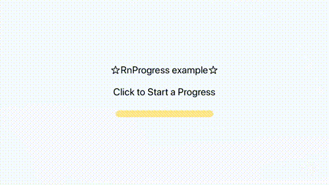

# rn-progress

## Improving!!! And Can Use Now
The interface will change a lot.



## Getting started

`$ npm install rn-progress --save`

### Mostly automatic installation

`$ react-native link rn-progress`

## Usage
```javascript


import React, {Component} from 'react';
import {Text, TouchableOpacity} from 'react-native';

import ProgressView from 'rn-progress';
import styles, {progressWidth, progressHeight} from './styles';
const MAX_VALUE = 300;
export default class App extends Component<{}> {
  constructor(props) {
    super(props);
    this.renderCount = 0;
    this.progressValue = 0;
  }

  startProgress = () => {
    this.progressValue = 0;
    this.updateProgressBar();
  };

  updateProgressBar = () => {
    this.progressValue++;
    if (this.progressValue > MAX_VALUE) {
      this.progressValue = 0;
    } else {
      setTimeout(this.updateProgressBar, 20);
    }

    this.progressView.setNativeProps({
      total: MAX_VALUE,
      current: this.progressValue,
    });
  };

  renderProgressBar = () => {
    return (
      <ProgressView
        progressHeight={progressHeight}
        progressWidth={progressWidth}
        barColorCurrent="#f18326"
        barColorCurrent2="#fcc769"
        barColorTotal="#fce789"
        style={styles.progressStyle}
        ref={(progressView) => {
          this.progressView = progressView;
        }}
      />
    );
  };

  render() {
    console.log(`Render Called: ${this.renderCount++}`);

    return (
      <TouchableOpacity style={styles.container} onPress={this.startProgress}>
        <Text style={styles.welcome}>☆RnProgress example☆</Text>
        <Text style={styles.welcome}>Click to Start a Progress</Text>
        {this.renderProgressBar()}
      </TouchableOpacity>
    );
  }
}


```

## Dev

Install watchman to enable hot reload ./* ./index.js, ./package.json ,... to ./example/node_modules/

Add current dir to wml.
```
wml add . ./example/node_modules/rn-progress
```

Start wml
```
 wml start   
```